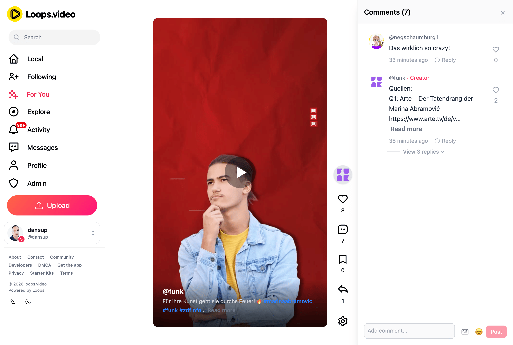

# Loops

  <strong>The short video sharing platform for the social web.</strong>
   
  Federated, open source, creator-friendly, and powered by <a href="https://fediverse.info">ActivityPub</a>.

  <a href="https://joinloops.org">Website</a>
  ·
  <a href="https://joinloops.org/developers">API Documentation</a>
  ·
  <a href="INSTALLATION.md">Installation</a>
  ·
  <a href="https://fedidb.com/software/loops">Server List</a>

  
  

  
  
  
  
  
  

  

## About Loops

Loops is a federated, open-source platform for sharing short videos. It gives creators and communities a modern short-video experience without locking them into a centralized platform.

This repository contains the Loops server and web application. Communities can operate their own Loops instance while connecting with people across Loops, Pixelfed, Mastodon, and other compatible ActivityPub platforms.

## Highlights

- **Federated by design** — connect and interact across the open social web using ActivityPub.
- **Self-hostable** — run an independent Loops server for your community.
- **Creator-friendly** — share short videos without advertising-driven platform incentives.
- **Community-controlled** — each server can establish its own rules, policies, and moderation practices.
- **Modern discovery** — explore Following and For You feeds, hashtags, profiles, and videos.
- **Social interactions** — support for comments, replies, mentions, likes, shares, and boosts.
- **Open API** — build applications and integrations using the JSON REST API and OAuth 2.0.
- **Open source** — inspect, modify, contribute to, and redistribute the software under the AGPLv3.

## Getting Started

### Install Loops

To deploy your own Loops server, see the [installation guide](INSTALLATION.md).

A Docker-based setup is also available in the [Docker Compose setup guide](DOCKER_COMPOSE_SETUP.md).

### Federation

See the [federation documentation](FEDERATION.md) for information about Loops and ActivityPub interoperability.

### API

The Loops API is an open, publicly documented JSON REST API secured with OAuth 2.0. No partnership, application, or prior approval is required to build clients, integrations, and new experiences for the Loops ecosystem.

- [Developer documentation](https://joinloops.org/developers)
- [Complete API reference](https://docs.joinloops.org)

## Contributing

Bug reports, feature requests, documentation improvements, translations, and pull requests are welcome.

Before participating, please read the [Code of Conduct](CODE_OF_CONDUCT.md).

- [Open an issue](https://github.com/joinloops/loops-server/issues)
- [View pull requests](https://github.com/joinloops/loops-server/pulls)
- [Join GitHub Discussions](https://github.com/joinloops/loops-server/discussions)

## Translations

Help make Loops available to more communities and languages through [Crowdin](https://crowdin.com/project/loops).

See the [translation guide](TRANSLATING.md) for contribution instructions.

## Community

Connect with the Loops community:

- **Website:** [joinloops.org](https://joinloops.org)
- **Blog:** [blog.joinloops.org](https://blog.joinloops.org)
- **Pixelfed:** [@loops@pixelfed.social](https://pixelfed.social/loops)
- **Discord:** [Join the Loops community](https://discord.gg/wvud8BgFv8)
- **Matrix:** [Join the Loops community](https://matrix.to/#/#loops:matrix.org)
- **Codeberg mirror:** [codeberg.org/loops](https://codeberg.org/loops)

## Funding

Loops is funded in part through [NGI Zero Core](https://nlnet.nl/core), a fund established by [NLnet](https://nlnet.nl) with support from the European Commission's [Next Generation Internet](https://ngi.eu) program.

Learn more on the [NLnet Loops project page](https://nlnet.nl/project/Loops).

  
  

## Supporters

Thanks to the [Fastly Fast Forward](https://www.fastly.com/fast-forward) program, Loops uses Fastly CDN and Object Storage to serve videos globally.

  

## License

Loops Server is open-source software licensed under the [GNU Affero General Public License v3.0](LICENSE).
